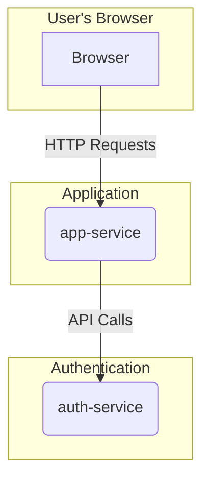

#

# Scalable Authentication and Application Services in Rust

This repository provides a robust foundation for building scalable microservices in Rust. It features a decoupled authentication service and a user-facing application service, built with a modern technology stack that includes Axum, Tokio, and a curated set of high-quality crates. The project demonstrates best practices in web application development, including domain-driven design, containerization, and comprehensive testing.

## Table of Contents

- [Project Overview](#project-overview)
- [Architecture](#architecture)
- [Core Dependencies](#core-dependencies)
- [Technical Deep Dive](#technical-deep-dive)
- [Development Environment Setup](#development-environment-setup)
- [Running the Services](#running-the-services)
- [Task Automation with Justfile](#task-automation-with-justfile)

## Project Overview
- `app-service`: Serves the web UI and handles browser interactions using server-rendered templates. It talks to the auth service for sign-up and login flows.
- `auth-service`: Exposes APIs for user registration and authentication, showcasing domain-driven design patterns (value objects for email/password, in-memory stores, etc.).

## Architecture



## Core Dependencies

This project leverages a curated set of high-quality crates to ensure robustness, performance, and developer productivity.

- **`axum`**: A powerful and ergonomic web framework for building robust APIs and web services.
- **`tokio`**: The de-facto asynchronous runtime for Rust, providing the foundation for concurrent and non-blocking I/O.
- **`tower-http`**: A collection of essential HTTP middleware for `axum`, used for features like serving static assets and CORS.
- **`serde` & `serde_json`**: For efficient and reliable serialization and deserialization of data between Rust structs and JSON.
- **`reqwest`**: A feature-rich and intuitive HTTP client for making requests to external services.

### Application Service

- **`askama`**: A type-safe and compiled template engine for server-side rendering of HTML, ensuring correctness at compile time.
- **`axum-extra`**: Provides useful extractors and utilities for `axum`, such as cookie handling.

### Authentication Service

- **`jsonwebtoken`**: Implements JSON Web Tokens (JWT) for secure, stateless authentication.
- **`validator`**: A library for data validation, ensuring the integrity of incoming requests.
- **`uuid`**: For generating and managing unique identifiers for users and other resources.
- **`async-trait`**: Enables the use of `async fn` in traits, simplifying asynchronous code.
- **`chrono`**: A comprehensive library for handling dates and times.
- **`lazy_static`**: Allows for the declaration of lazily initialized static variables.
- **`rand`**: A library for generating random numbers, used for cryptographic purposes.

### Testing

- **`fake`**: A library for generating realistic fake data for testing.
- **`quickcheck` & `quickcheck_macros`**: A framework for property-based testing, which helps in finding edge cases and bugs.

## Technical Deep Dive

### Asynchronous Runtime: Tokio

This project uses the `tokio` runtime to manage asynchronous tasks. By default, Tokio spins up a multi-threaded runtime, creating a thread for each CPU core on the machine. This allows the services to handle a large number of concurrent connections efficiently. Each incoming request is spawned as a new task on the runtime, which is then executed by one of the worker threads. This model allows for a high degree of concurrency, as the threads can switch between tasks whenever one is waiting for I/O.

### Web Framework: Axum

`axum` is a web framework built on top of `tokio` and `hyper`. It uses a tower-based middleware architecture, which allows for a flexible and composable way of handling requests. When a request comes in, it is passed through a series of middleware layers, each of which can modify the request or response. For example, the `tower-http` crate provides middleware for logging, compression, and serving static files.

### Service Communication

The `app-service` and `auth-service` communicate with each other via REST APIs. The `app-service` uses the `reqwest` crate to make HTTP requests to the `auth-service`. This allows for a clean separation of concerns, as the `app-service` does not need to know about the implementation details of the `auth-service`. It also allows the two services to be deployed and scaled independently.

### Service Initialization

Both the `app-service` and `auth-service` are initialized in their respective `main.rs` files. This is where the Axum router is created and configured, and where the various components of the service are wired together.

In the `app-service`, the `main.rs` file is responsible for:

-   Creating the Axum router.
-   Adding middleware for serving static files and handling errors.
-   Defining the routes for the web interface.
-   Starting the Axum server.

In the `auth-service`, the `main.rs` file is responsible for:

-   Creating the Axum router.
-   Adding middleware for CORS and error handling.
-   Defining the routes for the authentication API.
-   Initializing the in-memory stores for users and banned tokens.
-   Starting the Axum server.

## Development Environment Setup

To get started with this project, you will need to have the Rust toolchain and `cargo-watch` installed.

1.  **Install Rust:** If you don't have Rust installed, you can get it from [rust-lang.org](https://www.rust-lang.org/tools/install).

2.  **Install `cargo-watch`:** This tool is used to automatically rebuild and rerun the services when changes are made to the source code.

    ```bash
    cargo install cargo-watch
    ```

3.  **Build the services:**

    ```bash
    # Build the application service
    cd app-service
    cargo build

    # Build the authentication service
    cd ../auth-service
    cargo build
    ```

## Running the Services

### Manual Execution

For development, you can run the services manually using `cargo-watch`. This will automatically restart the services whenever you make changes to the code.

#### Application Service

The application service is responsible for the user-facing web interface. To run it, execute the following command:

```bash
cd app-service
cargo watch -q -c -w src/ -w assets/ -w templates/ -x run
```

The application service will be available at `http://localhost:8000`.

#### Authentication Service

The authentication service handles user registration, login, and other authentication-related tasks. To run it, execute the following command:

```bash
cd auth-service
cargo watch -q -c -w src/ -w assets/ -x run
```

The authentication service will be available at `http://localhost:3000`.

### Docker-based Execution

For a more production-like environment, you can use Docker to run the services. This ensures that the services are running in a consistent and isolated environment.

1.  **Create a `.env` file:**

    Create a `.env` file in the root of the project with the following content:

    ```
    JWT_SECRET=your-secret
    ```

2.  **Run the services:**

    ```bash
    ./docker.sh
    ```

    This will build the Docker images and start the services.

    - The application service will be available at `http://localhost:8000`.
    - The authentication service will be available at `http://localhost:3000`.